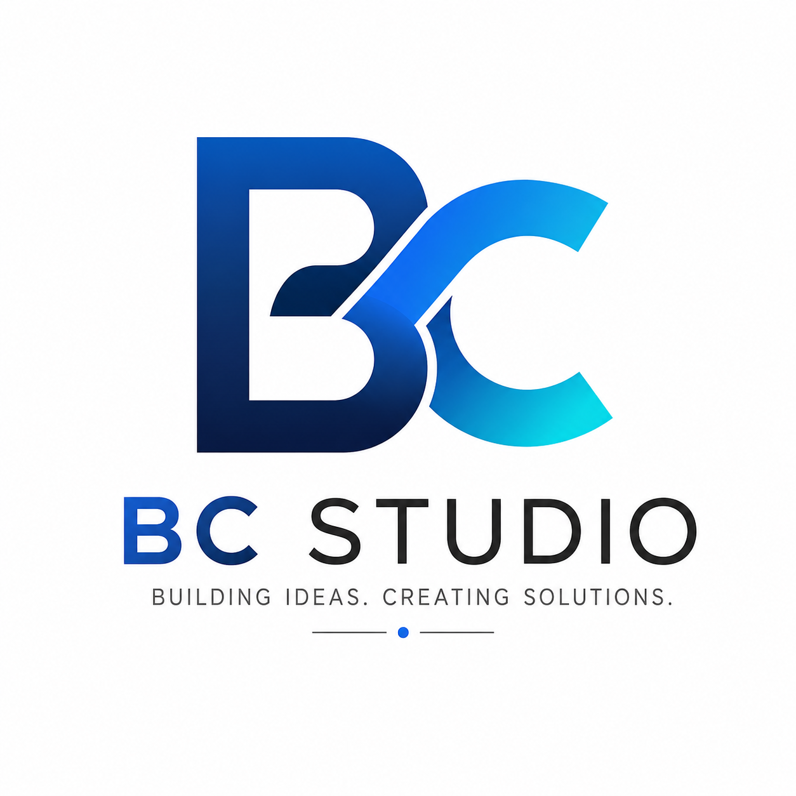

  

<h1 align="center">BC STUDIO</h1>

Building simple, beautiful mobile applications

  
  
  

#  BC Studio

### Building simple, beautiful and productive mobile applications.

Welcome to **BC Studio**.

We are passionate about creating mobile applications that help businesses and individuals work smarter. Our mission is to deliver software that is simple to use, visually appealing, and solves real-world problems.

---

## 🚀 Our Mission

> Build practical software that simplifies everyday business operations.

We believe technology should be easy, accessible, and affordable for everyone—from small cafés and retail shops to freelancers and growing businesses.

---

# 📱 Products

## Easy Invoice Maker *(In Development)*

A modern invoice and receipt application designed for small businesses.

### Features

* Invoice Creation
* Customer Management
* Product Management
* PDF Invoice Export
* Professional Invoice Templates
* Business Profile
* Sales Dashboard
* QR Payment Support
* Offline-first Experience
* Cloud Synchronization *(Upcoming)*

---

## Word Puzzle Game

A fun and challenging word game built with Flutter.

### Features

* Hundreds of Levels
* Daily Challenges
* Hint System
* Coin Rewards
* Offline Gameplay
* Smooth Animations

---

# 🛠 Technology Stack

### Mobile

* Flutter
* Dart

### Backend

* Supabase
* PostgreSQL

### Database

* PostgreSQL
* SQLite

### Cloud

* Supabase
* Firebase

### Languages

* Dart
* SQL
* PL/SQL

### Tools

* Git
* GitHub
* Android Studio
* VS Code
* Figma

---

# 🏗 Development Principles

Every project at BC Studio follows these principles:

* Clean Architecture
* Feature-first Folder Structure
* Reusable Components
* Responsive UI
* Offline-first Design
* Performance Focused
* Scalable Codebase
* User-centered Experience

---

# 📂 Featured Projects

| Project               | Description                                      |
| --------------------- | ------------------------------------------------ |
| Easy Invoice Maker    | Smart invoicing application for small businesses |
| Flutter UI Components | Reusable Flutter widgets and UI components       |
| Flutter Utilities     | Helper libraries and reusable utilities          |
| Word Puzzle Game      | Mobile puzzle game developed with Flutter        |
| Supabase Examples     | Flutter + Supabase learning projects             |

---

# 🎯 Current Focus

Currently building:

* 📱 Easy Invoice Maker
* 🧩 Flutter UI Component Library
* ☁️ Flutter + Supabase Architecture
* 📄 Invoice PDF Generator
* 📊 Business Dashboard UI

---

# 💡 What We Love Building

* Business Applications
* POS Systems
* Invoice Systems
* Inventory Management
* Productivity Apps
* Flutter UI Libraries
* Mobile Games
* Backend APIs

---

# 📈 2026 Goals

* Launch Easy Invoice Maker on Google Play
* Publish open-source Flutter packages
* Build reusable Flutter UI libraries
* Reach 1,000+ app downloads
* Continue learning and sharing knowledge
* Grow BC Studio into a trusted software brand

---

# 🌱 Always Learning

We continuously improve our skills in:

* Flutter
* Dart
* Clean Architecture
* Mobile UI/UX
* Supabase
* PostgreSQL
* Software Design Patterns
* Performance Optimization

---

# 🤝 Open Source

We enjoy contributing to the developer community by sharing:

* Flutter Components
* Sample Projects
* UI Templates
* Utility Packages
* Learning Resources

---

# 📸 Portfolio

Coming Soon

* Application Screenshots
* UI Showcase
* Product Videos
* Design Concepts

---

# 📬 Contact

Feel free to connect or collaborate.

* GitHub
* LinkedIn
* Email

---

# ⭐ Vision

> Empower every small business with simple, affordable, and beautiful software.

Thank you for visiting BC Studio.

If you find our work helpful, consider giving our repositories a ⭐.

Let's build something amazing together.
